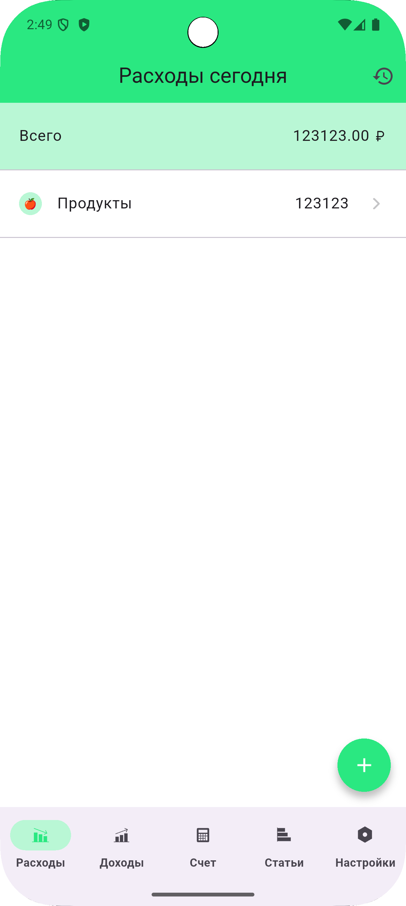
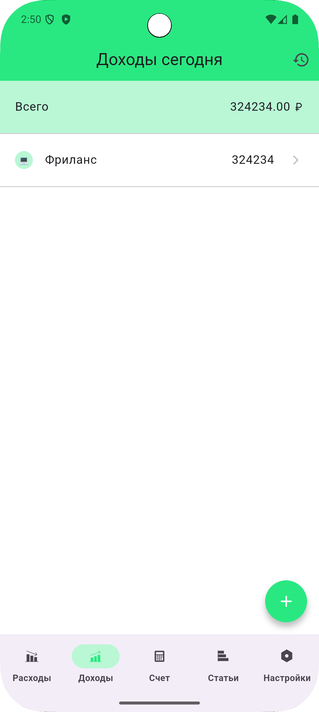
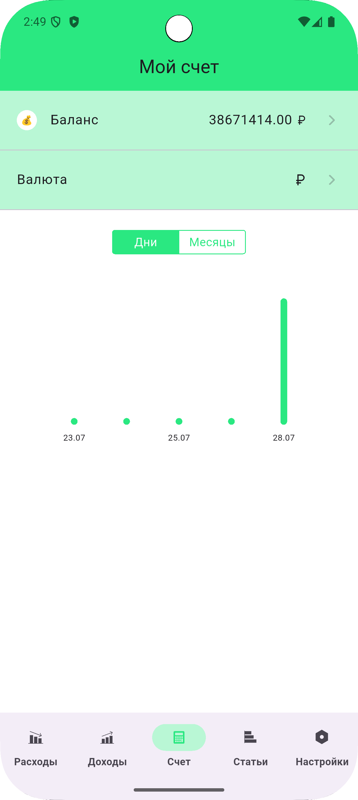
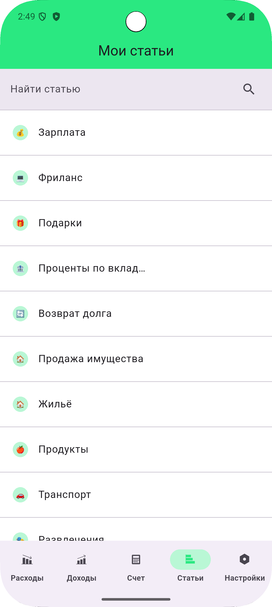
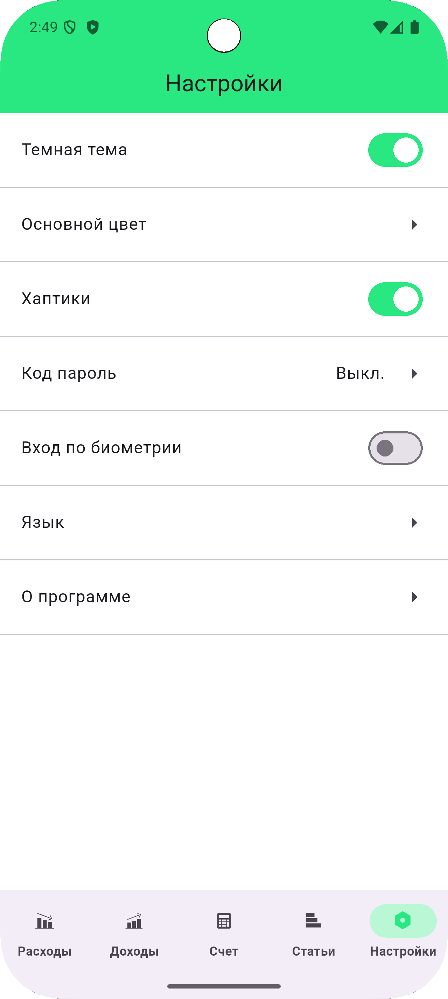
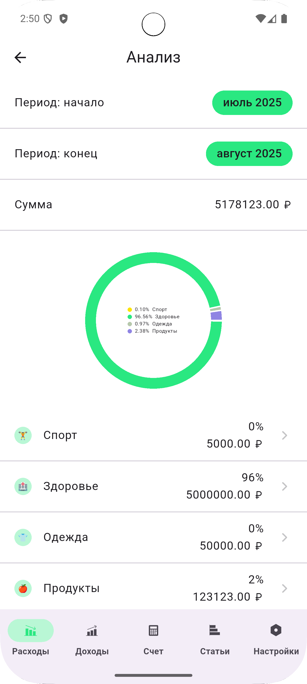

# finance_hunter_app

Finance Hunter application

🔐 Настройка переменных окружения
Для запуска проекта необходимо создать файл .env в корне проекта и указать в нём следующие переменные:

env

# Адрес API-бэкенда
BASE_URL=вставь_сюда_base_url

# Токен авторизации (замени на свой)
AUTH_TOKEN=вставь_сюда_свой_токен

## UI приложение

1.  **Экран расходов на сегодня**

2.  **Экран доходов на сегодня**

3.  **Экран "Мой счет"**

4.  **Экран "Мои статьи"**

5.  **Экран Настройки**

6.  **Экран Анализа транзакции за определенный период**
